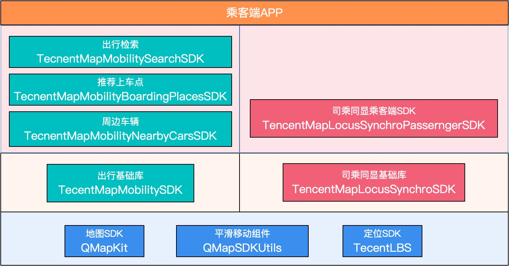
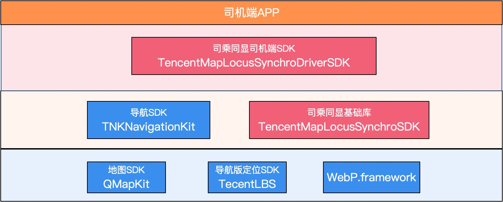

# 出行SDK接入文档（iOS）

## 概述

出行SDK是针对于出行场景开发的多个SDK，包括:周边车辆SDK,推荐上车点SDK，出行检索SDK和司乘同显SDK。每个SDK功能独立、接入方便，开发者可以根据自己的需求进行选择。

乘客端:

司机端:

## 接口文档地址

https://tencentmap-mobility.github.io/

## 依赖项

`拉取代码之后，请将腾讯导航SDK+定位SDK放至mapmobilitydemo/Dependency/目录下，否则会编译错误！`

1. 导航SDK下载地址: https://github.com/tencentmap-mobility/TencentNaviDemo_iOS/releases/tag/v5.3.0
2. 定位SDK下载地址: https://github.com/tencentmap-mobility/TencentNaviDemo_iOS/releases/tag/v5.2.7.11

### 腾讯地图SDK QMapKit.framework
详细信息和使用方式可以在官网https://lbs.qq.com上获得。

## SDK文档列表
1. [出行周边车辆SDK](docs/TencentMapMobilityNearbyCarsSDK.md)
2. [出行推荐上车点SDK](docs/TencentMapMobilityBoardingPlacesSDK.md)
3. [出行检索SDK](docs/TencentMapMobilitySearchSDK.md)
4. [出行SDK基础库](docs/MobilitySDK.md)
5. [司乘同显SDK](docs/TencentMapLocusSyncSDK.md)
6. [司乘同显司机端流程](docs/TencentMapLocusSyncDriverSDK.md)
7. [司乘同显乘客端流程](docs/TencentMapLocusSyncPassengnerSDK.md)
