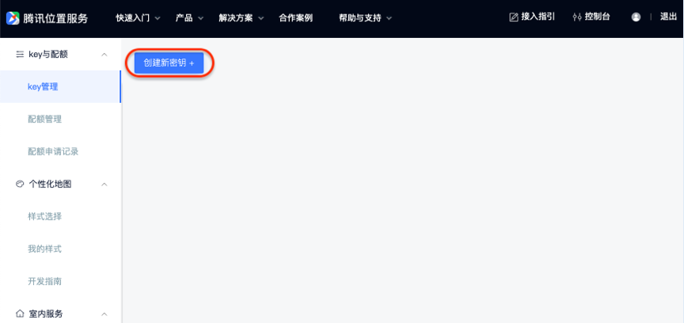
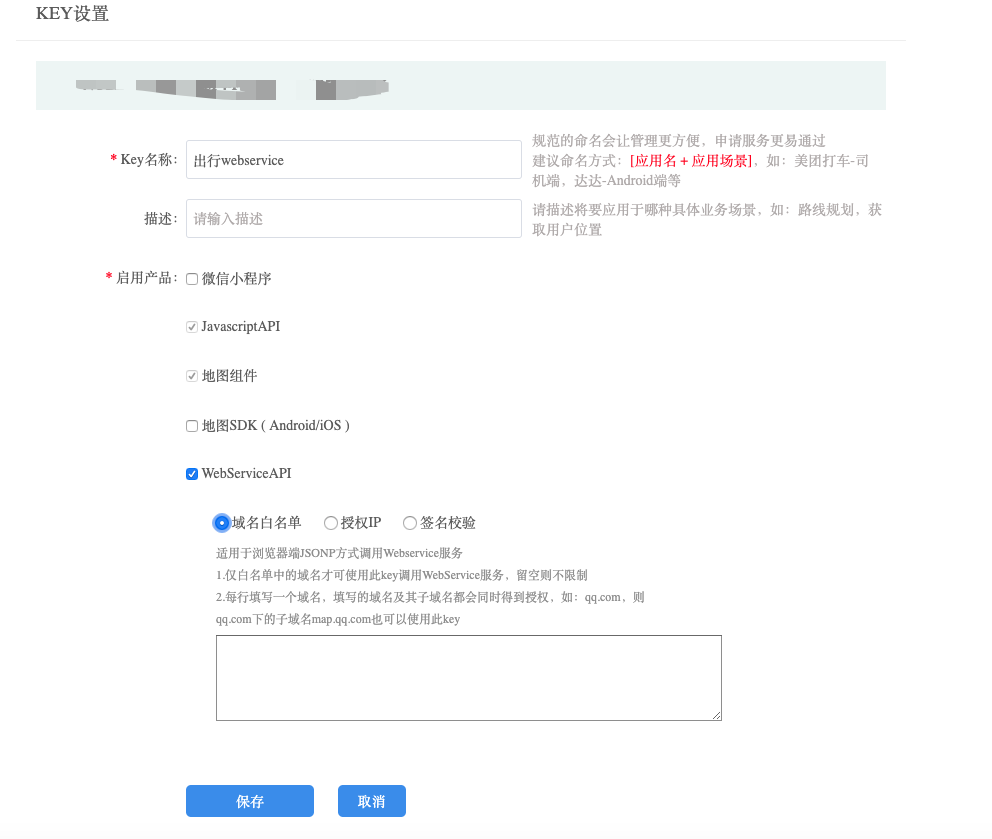
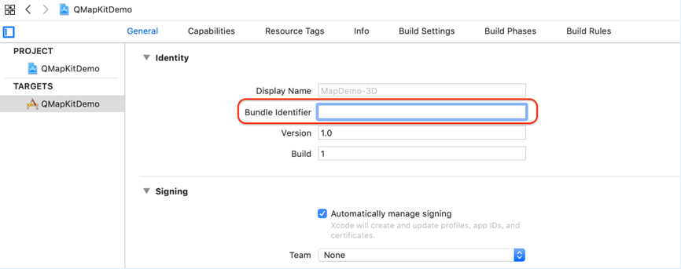
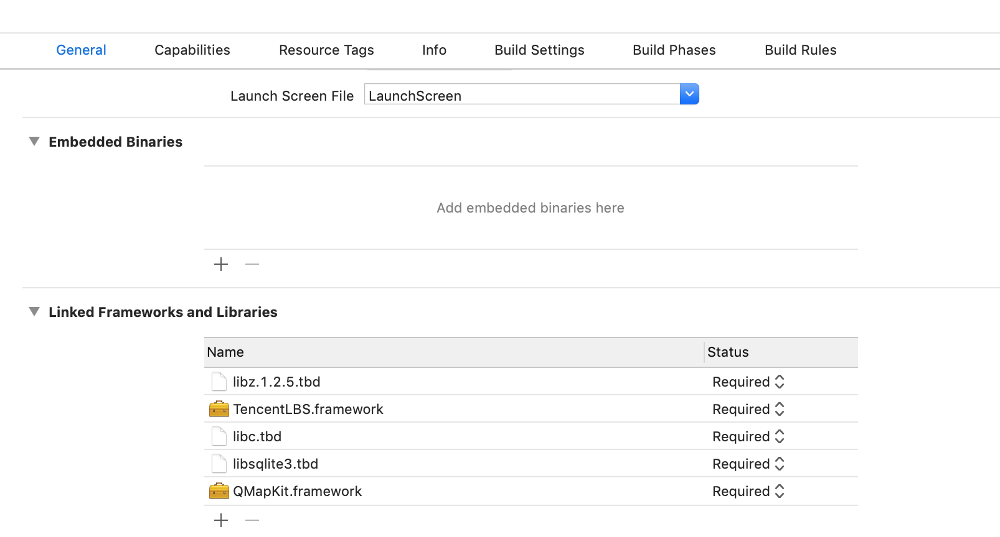
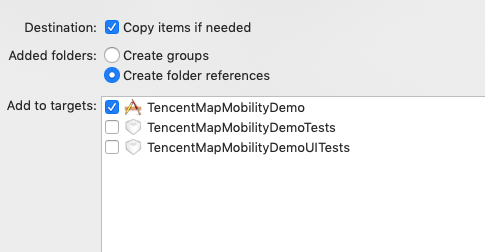

# 出行SDK接入文档（iOS）

## 概述

出行SDK，是针对于出行场景开发的SDK。该产品能够进行用户周边不同功能的车辆展示，力求提供用户更优质的出行体验。

## 准备工作

一、申请开发密钥

出行SDK使用前需要先配置APIKey进行鉴权，因为出行SDK中会引用地图SDK和WebServiceAPI，因此可以同时配置地图SDK和webServiceAPI为统一的Key，可前往[http://lbs.qq.com/console/mykey.html](http://lbs.qq.com/console/mykey.html)点击“创建新密钥”进行配置



创建成功后，根据项目需求对key进行设置



获取Bundle Identifier 方法：打开Xcode，点击工程，如图




注：

1.地图SDK功能需要设置相应的Bundle Identifier，使用时key和Bundle Identifier需要保持一致

2.对于WebServiceAPI的key申请配置，只能使用第一种“域名白名单”（不需要在SDK中额外设置）或者第三种“签名校验”（需在SDK中配置secretKey）


## 工程配置

一、配置地图SDK   
出行SDK需要依赖3D地图SDK（4.1.1以上版本），可在官网进行3D地图SDK的下载和工程配置（地图工程配置指引:[https://lbs.qq.com/ios_v1/guide-project-setup.html](https://lbs.qq.com/ios_v1/guide-project-setup.html)）
注：4.1.1以上版本的地图SDK和5.0.0版本以上的导航SDK均已支持libc++.tbd

二、配置定位SDK      
同时出行SDK需使用定位SDK（TencentLBS.framework）
使用方法可以具体参考官网：[https://lbs.qq.com/iosgeo/guide-project-setup.html](https://lbs.qq.com/iosgeo/guide-project-setup.html)

注：   
1.配置完成后， 检查"Build Phases"->"Link Binary With Libraries"，如下图（Xcode9 以上）   
   

2.要将地图SDK的“QMapKit.framework”和定位SDK的“TencentLBS.framework”以及出行SDK的“TencentMapMobilitySDK.framework”加入到自己的工程中。   
添加方法：在工程界面右键弹出菜单中选择"Add Files To..."，注意添加时在弹出窗口中勾选"Copy items if needed" 。   
 

## 快速接入

一、配置key

在工程的“AppDelegate.m”中引入“#import < QMapKit/QMapKit.h >” 和“#import < TencentMapMobilitySDK/TMMServices.h >”

```objc

- (BOOL)application:(UIApplication *)application didFinishLaunchingWithOptions:(NSDictionary *)launchOptions {
    
    [QMapServices sharedServices].APIKey = @"您的key";
    [TMMServices sharedServices].apiKey = @"您的key";
    return YES;
}
```

因出行SDK需要使用定位SDK，所以需要在使用时配置定位SDK的key

```objc
    [self.locationManager setApiKey:@"您的key"];
```

二、周边车辆展示初始化

```objc

@property (nonatomic, strong) QMapView *mapView;

- (void) setupNearbyCars
{
	self.mapView.nearbyCarsEnabled = YES;
	TMMNearbyCarConfig *nearbyCarConfig = [[TMMNearbyCarConfig alloc] init];
	
	// 默认mock = 1， 为模拟情况，不需进行额外配置； mock = 0 时，为真实情况，需同时配置定位SDK中的cityCode,见下方 “三、定位SDK配置”
	nearbyCarConfig.mock = 0;
	
	// 中心点大头针位置配置，默认为（0.5，0.5）
	CGPoint pinPosition = CGPointMake(0.5, 0.3);
	self.mapView.tmm_pinPosition = pinPosition;
	self.mapView.nearbyCarConfig = nearbyCarConfig;
}
```

三、定位SDK配置

```objc

// locationManager配置
- (void)setupLocationManager
{
    
    self.locationManager = [[TencentLBSLocationManager alloc] init];
    [self.locationManager setDelegate:self];
    [self.locationManager setAllowsBackgroundLocationUpdates:YES];
    [self.locationManager setApiKey:@"您的key"];
    
    [self.locationManager setPausesLocationUpdatesAutomatically:NO];
    
    // 需要后台定位的话，可以设置此属性为YES。
    [self.locationManager setAllowsBackgroundLocationUpdates:YES];
    
    // 如果需要POI信息的话，根据所需要的级别来设定，定位结果将会根据设定的POI级别来返回，如：
    [self.locationManager setRequestLevel:TencentLBSRequestLevelAdminName];
    
    // 申请的定位权限，得和在info.list申请的权限对应才有效
    CLAuthorizationStatus authorizationStatus = [CLLocationManager authorizationStatus];
    if (authorizationStatus == kCLAuthorizationStatusNotDetermined) {
        [self.locationManager requestWhenInUseAuthorization];
    }
}

// 单次定位
- (void)startSingleLocation {
    [self.locationManager requestLocationWithCompletionBlock:
     ^(TencentLBSLocation *location, NSError *error) {
         NSLog(@"%@, %@, %@", location.location, location.name, location.address);
     }];
}

// 连续定位
- (void)startSerialLocation {
    //开始定位
    [self.locationManager startUpdatingLocation];
}

- (void)stopSerialLocation {
    //停止定位
    [self.locationManager stopUpdatingLocation];
}

// 定位更新回调
- (void)tencentLBSLocationManager:(TencentLBSLocationManager *)manager
                didUpdateLocation:(TencentLBSLocation *)location {
    
    //定位结果
    NSLog(@"location:%@", location.location);
    NSLog(@"city code: %@", location.code);
    
    self.cityCode = location.code;
    
    // 当mock = 0时，需同时设置cityCode
    self.mapView.tmm_cityCode = self.cityCode;
}


```

## 常见问题

1. 下载该demo时，出现Undefined symbol: _OBJC_CLASS_$_

解法：QMapKit的静态库需要手动下载或者用git lfs进行下载
