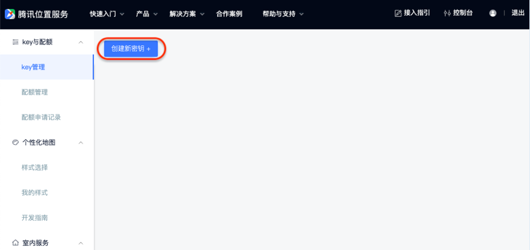
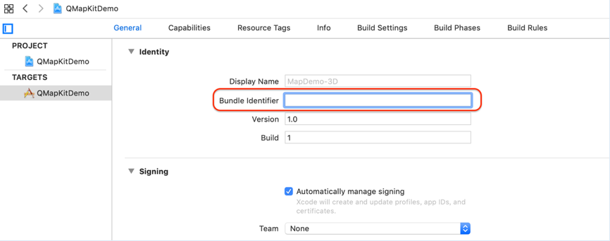

# 出行SDK接入文档（iOS）

## 概述

出行SDK，是针对于出行场景开发的SDK。该产品能够进行用户周边不同功能的车辆展示，力求提供用户更优质的出行体验。

## 准备工作

一、申请开发密钥

出行SDK使用前需要先配置APIKey进行鉴权，因为出行SDK中会引用地图SDK和WebServiceAPI，因此可以同时配置地图SDK和webServiceAPI为统一的Key，可前往[http://lbs.qq.com/console/mykey.html](http://lbs.qq.com/console/mykey.html)点击“创建新密钥”进行配置

创建成功后，根据项目需求对key进行设置

获取Bundle Identifier 方法：打开Xcode，点击工程，如图

注：

1.地图SDK功能需要设置相应的Bundle Identifier，使用时key和Bundle Identifier需要保持一致

2.对于WebServiceAPI的key申请配置，只能使用第一种“域名白名单”（不需要在SDK中额外设置）或者第三种“签名校验”（需在SDK中配置secretKey）

## 工程配置

一、配置地图SDK   
出行SDK需要依赖3D地图SDK（4.1.1以上版本），可在官网进行3D地图SDK的下载和工程配置（地图工程配置指引:[https://lbs.qq.com/ios_v1/guide-project-setup.html](https://lbs.qq.com/ios_v1/guide-project-setup.html)）
注：4.1.1以上版本的地图SDK和5.0.0版本以上的导航SDK均已支持libc++.tbd

二、配置定位SDK      
同时出行SDK需使用定位SDK（TencentLBS.framework）
使用方法可以具体参考官网：[https://lbs.qq.com/iosgeo/guide-project-setup.html](https://lbs.qq.com/iosgeo/guide-project-setup.html)

注：   
1.配置完成后， 检查"Build Phases"->"Link Binary With Libraries"，如下图（Xcode9 以上）   
   

2.要将地图SDK的“QMapKit.framework”和定位SDK的“TencentLBS.framework”以及出行SDK的“TencentMapMobilitySDK.framework”加入到自己的工程中。   
添加方法：在工程界面右键弹出菜单中选择"Add Files To..."，注意添加时在弹出窗口中勾选"Copy items if needed" 。   
 

## 快速接入

MobilitySDK为整个出行SDK的基础库，直接引入framework即可，但必须引入。

## 常见问题

1. 下载该demo时，出现Undefined symbol: _OBJC_CLASS_$_

解法：QMapKit的静态库需要手动下载或者用git lfs进行下载
