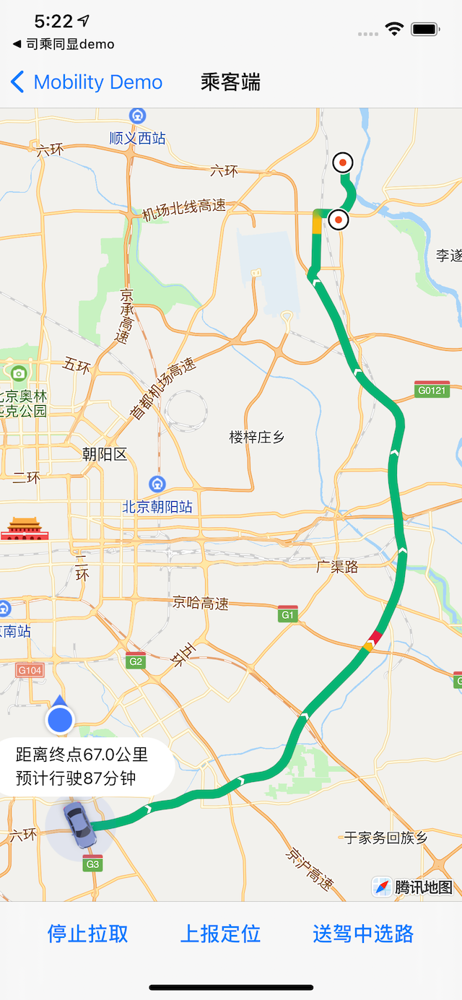

# 司乘同显SDK乘客端（iOS）


## 1. 初始化配置

1.1 在工程的AppDelegate.m中引入配置key


```objc

#import < QMapKit/QMapKit.h >
#import <TNKNavigationKit/TNKNaviServices.h>

- (BOOL)application:(UIApplication *)application didFinishLaunchingWithOptions:(NSDictionary *)launchOptions {
    
    // 配置地图key
    [QMapServices sharedServices].APIKey = @"您的key";
    
    return YES;
}
```

1.2 需要配置司乘同显SDK的key，乘客id

```objc
    TLSPConfig *pConfig = [[TLSPConfig alloc] init];
    pConfig.key = @"您的key";
    // 如果设置签名校验的方式，则需要配置secretKey
    pConfig.sectetKey = @"您的secretKey"; 
    pConfig.passengerID = kSynchroPassenger1ID;
    
    self.passengerManager.delegate = self;
```


## 2. 司乘同显乘客端主流程

2.1 司机接单后，乘客端可开启司乘同显，需要设置对应的订单号

```objc
    self.passengerManager.orderID = kSynchroDriverOrderID;
    self.passengerManager.pOrderID = kSynchroPassenger1OrderID;
    self.passengerManager.orderType = TLSBOrderTypeNormal;
    self.passengerManager.orderStatus = TLSBOrderStatusPickup;
    [self.driverManager start];
```

2.2 通过回调获取相应的司机路线，轨迹和订单信息

```objc
- (void)tlsPassengerManager:(TLSPassengerManager *)passengerManager didFetchedData:(TLSPFetchedData *)fetchedData
{
    
    // 更新路线需重新绘制.
    if (![self.currentRouteID isEqualToString:fetchedData.route.routeID]) {
        
        // 重新绘制路线.
        [self updateRoute:fetchedData.route];
    }
    // 相同路线更新路况.
    else
    {
        if(fetchedData.route.trafficItems != nil)
        {
            [self updateRouteTraffic:fetchedData.route.trafficItems];
        }
    }
    
    
    // 更新位置.
    [self updateLocation:fetchedData.positions];
      
}

```

2.3 接到乘客后，将订单状态改为送驾

```objc
    self.passengerManager.orderStatus = TLSBOrderStatusTrip;
```

2.4 结束司乘同显

```objc
 	[self.passengerManager stop];
```

## 3. 接力单
 


```objc
- (void)tlsPassengerManager:(TLSPassengerManager *)passengerManager didFetchedData:(TLSPFetchedData *)fetchedData;
```

如果当前乘客的订单是接力单，那么这个订单的路线会分为两段：司机送其他乘客的送驾路线和司机送其他乘客后接驾路线。
如果当前是接力单，则fetchedData的relayRoute存在，路线需要拼接route+relayRoute， 剩余时间和里程也需要拼接，可参考demo

## 4. 乘客选路
乘客可以在送驾前和送驾中去提前选择或切换送驾路线。

### 4.1 送驾前选路
送驾前包括乘客等待接单时段和接驾时段。调用TLSPassengerManager相关方法获取路线多方案，最多3条路线

```objc
/**
 * @brief 行前驾车路线规划. since 2.2.0
 * @param request 驾车请求参数
 * @param completion 驾车请求结果
 * @return 请求Task
 */
- (NSURLSessionTask * _Nullable)queryDrivingWithRequest:(TLSPSearchDrivingRequest *)request
                                             completion:(void(^)(TLSPSearchDrivingResponse * _Nullable response,
                                                                 NSError * _Nullable error))completion;
```

开发者自定义选路页面，当乘客确定路线后，调用TLSPassengerManager选择送驾路线方法:

```objc
/// 送驾前乘客选择送驾路线方法. since 2.2.0
/// @param route 路线信息。
- (void)chooseRouteBeforeTrip:(TLSBRoute *)route;
```


### 4.2 送驾中选路
 

```objc
- (void)tlsPassengerManager:(TLSPassengerManager *)passengerManager didFetchedData:(TLSPFetchedData *)fetchedData;
```

送驾中，fetchedData除了返回当前路线route以外，也返回备选路线列表backupRoutes。开发者自定义选路页面，当乘客确定切换路线后，调用TLSPassengerManager切换路线方法:

```objc
/// 送驾中乘客选路方法. since 2.2.0
/// @param route 路线信息。路线信息中routeID不可为空
- (void)chooseRouteWhenTrip:(TLSBRoute *)route;
```


## 5. 司乘同显乘客端回调

```objc
/**
 * @brief 司乘同显-乘客管理类代理
 */
@protocol TLSPassengerManagerDelegate <NSObject>

@optional

/**
 * @brief 上报定位成功回调
 * @param passengerManager 乘客端管理类
 */
- (void)tlsPassengerManagerDidUploadLocationSuccess:(TLSPassengerManager *)passengerManager;

/**
 * @brief 上报定位失败回调
 * @param passengerManager 乘客端管理类
 * @param error 错误信息
 */
- (void)tlsPassengerManagerDidUploadLocationFail:(TLSPassengerManager *)passengerManager error:(NSError *)error;

/**
 * @brief 乘客拉取司机信息成功回调
 * @param passengerManager 乘客端管理类
 * @param fetchedData 乘客拉取司机的信息
 */
- (void)tlsPassengerManager:(TLSPassengerManager *)passengerManager didFetchedData:(TLSPFetchedData *)fetchedData;

/**
 * @brief 拉取司机信息失败回调
 * @param passengerManager 乘客端管理类
 * @param error 错误信息
 */
- (void)tlsPassengerManager:(TLSPassengerManager *)passengerManager didFailWithError:(NSError *)error;


/**
 * @brief 发起选路请求成功回调. since 2.2.0
 * @param passengerManager 乘客端管理类
 */
- (void)tlsPassengerManagerDidSendRouteRequestSuccess:(TLSPassengerManager *)passengerManager;

/**
 * @brief 发起选路请求失败回调. since 2.2.0
 * @param passengerManager 乘客端管理类
 * @param error 错误信息
 */
- (void)tlsPassengerManagerDidSendRouteRequestFail:(TLSPassengerManager *)passengerManager error:(NSError *)error;

@end
```
