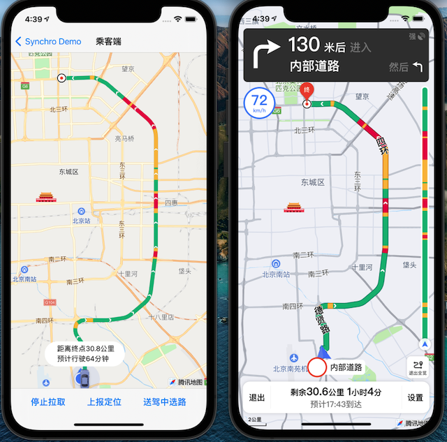
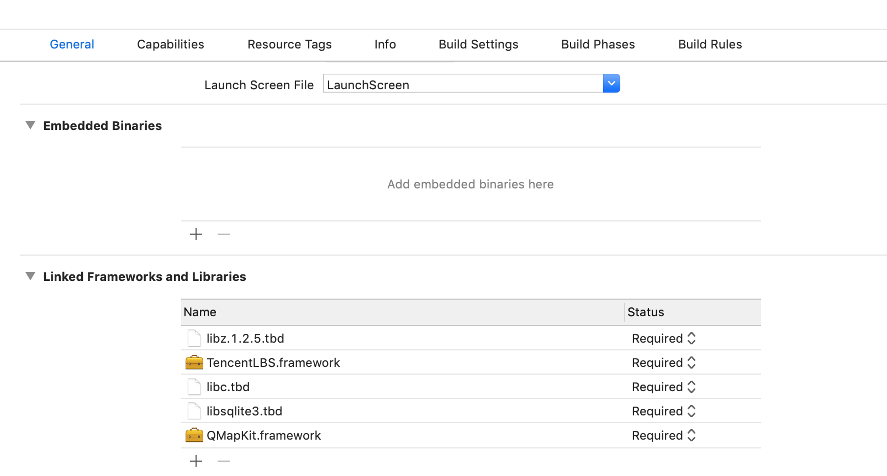
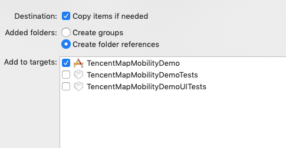

# 司乘同显SDK接入文档（iOS）

## 概述

司乘同显SDK是在网约车接驾送驾场景中，帮助司机和乘客两端实时了解行程信息，主要可以同步展示司机端的路线、路况、剩余里程和剩余时间以及双方的实时位置和行驶轨迹。
   
乘客端使用司乘同显SDK时，需要依赖地图SDK，使用地图SDK中的路线绘制、添加覆盖物等功能。

使用司乘同显SDK时首先需要通过订单同步接口创建订单，并且需配置订单ID、司机ID和乘客ID来建立三者的关联关系。另外，订单有三个属性，分别是订单ID，订单类型和订单状态，订单类型包括快车和顺风车，订单状态包括未派单、已派单、计费中；

用户可使用Demo查看司乘同显SDK的使用效果。准备两个手机，一个打开司机端，另一个打开乘客端。测试时，司机端已开启同步功能并且已经进入导航界面，乘客端点击“启动同步”按钮，可看到司机端当前路线和小车的平滑移动。

 
 

## 准备工作

申请开发密钥

司乘同显SDK使用前需要先配置APIKey进行鉴权，具体可联系对应的商务同学来开通。

## 工程配置

一、配置地图SDK （必须）  
司乘同显SDK（司机端&乘客端）需要依赖3D地图SDK（4.1.1以上版本），可在官网进行3D地图SDK的下载和工程配置（地图工程配置指引:[https://lbs.qq.com/ios_v1/guide-project-setup.html](https://lbs.qq.com/ios_v1/guide-project-setup.html)）
注：4.1.1以上版本的地图SDK和5.0.0版本以上的导航SDK均已支持libc++.tbd

二、配置导航SDK （必须）

同时司乘同显SDK（司机端）需使用导航SDK，具体可联系对应的商务同学来开通。

三、配置定位SDK（非必须）    
同时司乘同显demo（司机端&乘客端）使用定位SDK（TencentLBS.framework）
使用方法可以具体参考官网：[https://lbs.qq.com/iosgeo/guide-project-setup.html](https://lbs.qq.com/iosgeo/guide-project-setup.html)

四、小车平滑移动SDK（非必须） 

同时司乘同显demo（乘客端）需使用小车平滑移动SDK（QMapSDKUtils.framework），具体可联系对应的商务同学来开通。

注：   
1.配置完成后， 检查"Build Phases"->"Link Binary With Libraries"，如下图（Xcode9 以上）   
   

2.要将地图SDK的“QMapKit.framework”和定位SDK的“TencentLBS.framework”以及司乘同显SDK的“TencentMapLocusSynchroSDK.framework”，“TencentMapLocusSynchroDriverSDK.framework”, "TencentMapLocusSynchroPassengerSDK.framework"加入到自己的工程中。   
添加方法：在工程界面右键弹出菜单中选择"Add Files To..."，注意添加时在弹出窗口中勾选"Copy items if needed" 。   
 

## 快速接入
1. [司乘同显司机端流程](TencentMapLocusSyncDriverSDK.md)
2. [司乘同显乘客端流程](TencentMapLocusSyncPassengnerSDK.md)
