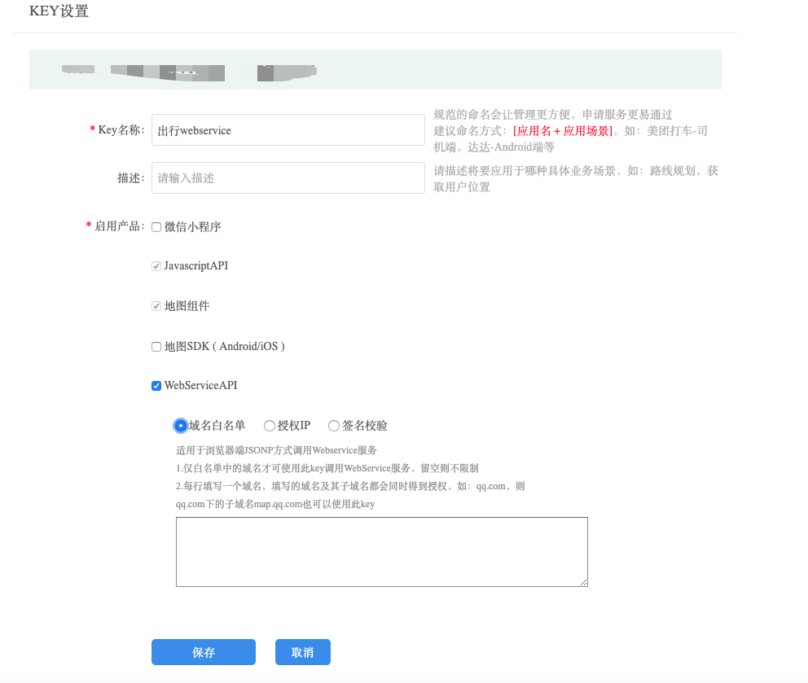

# 推荐上车点SDK接入文档（iOS）

## 概述

推荐上车点SDK，是针对于出行场景（推荐上车点）开发的SDK。该产品能够进行用户周边不同推荐上车点展示，力求提供用户更优质的出行体验。

## 准备工作

一、申请开发密钥

出行SDK使用前需要先配置APIKey进行鉴权，因为出行SDK中会引用地图SDK和WebServiceAPI，因此可以同时配置地图SDK和webServiceAPI为统一的Key，可前往[http://lbs.qq.com/console/mykey.html](http://lbs.qq.com/console/mykey.html)点击“创建新密钥”进行配置


创建成功后，根据项目需求对key进行设置



获取Bundle Identifier 方法：打开Xcode，点击工程，如图


注：

1.地图SDK功能需要设置相应的Bundle Identifier，使用时key和Bundle Identifier需要保持一致

2.对于WebServiceAPI的key申请配置，只能使用第一种“域名白名单”（不需要在SDK中额外设置）或者第三种“签名校验”（需在SDK中配置secretKey）


## 工程配置

一、配置地图SDK   
推荐上车点SDK需要依赖3D地图SDK（4.1.1以上版本），可在官网进行3D地图SDK的下载和工程配置（地图工程配置指引:[https://lbs.qq.com/ios_v1/guide-project-setup.html](https://lbs.qq.com/ios_v1/guide-project-setup.html)）
注：4.1.1以上版本的地图SDK和5.0.0版本以上的导航SDK均已支持libc++.tbd

二、配置定位SDK      
同时推荐上车点SDK需使用定位SDK（TencentLBS.framework）
使用方法可以具体参考官网：[https://lbs.qq.com/iosgeo/guide-project-setup.html](https://lbs.qq.com/iosgeo/guide-project-setup.html)

注：   
1.配置完成后， 检查"Build Phases"->"Link Binary With Libraries"，如下图（Xcode9 以上）   
   

2.要将地图SDK的“QMapKit.framework”和定位SDK的“TencentLBS.framework”以及出行SDK的“TencentMapMobilitySDK.framework”加入到自己的工程中。   
添加方法：在工程界面右键弹出菜单中选择"Add Files To..."，注意添加时在弹出窗口中勾选"Copy items if needed" 。   
 

## 快速接入

一、配置key

在工程的“AppDelegate.m”中引入“#import < QMapKit/QMapKit.h >” 和“#import < TencentMapMobilitySDK/TMMServices.h >”

```objc

- (BOOL)application:(UIApplication *)application didFinishLaunchingWithOptions:(NSDictionary *)launchOptions {
    
    [QMapServices sharedServices].APIKey = @"您的key";
    [TMMServices sharedServices].apiKey = @"您的key";
    return YES;
}
```

因推荐上车点SDK需要使用定位SDK，所以需要在使用时配置定位SDK的key

```objc
    [self.locationManager setApiKey:@"您的key"];
```

二、推荐上车点展示初始化

```objc

1. 创建manager
	@property (nonatomic, strong) TMMNearbyBoardingPlacesManager *bpManager;

2. 设置地图
- (void)setupMapView
{
    self.mapView = [[QMapView alloc] initWithFrame:self.view.bounds];
    self.mapView.autoresizingMask  = UIViewAutoresizingFlexibleWidth | UIViewAutoresizingFlexibleHeight;
    self.mapView.delegate = self;
    self.mapView.showsUserLocation = YES;
    self.mapView.rotateEnabled = NO;
    self.mapView.zoomLevel = 15;
    self.mapView.overlookingEnabled = NO;
    
    // 显示中心点
    self.mapView.tmm_centerPinViewHidden = NO;
    [self.mapView.tmm_centerPinView setCalloutAttribtedText:[[NSAttributedString alloc] initWithString:@"在这里上车" attributes:@{NSForegroundColorAttributeName : [UIColor blackColor], NSFontAttributeName : [UIFont systemFontOfSize:13]}]];
    self.mapView.tmm_centerPinView.calloutViewHidden = NO;
    
    // 设置大头针的相对位置(0.5, 0.5)为地图中心点
    CGPoint pinPosition = CGPointMake(0.5, 0.5);
    self.mapView.tmm_pinPosition = pinPosition;
    
    [self.view addSubview:self.mapView];
}

3. 配置推荐上车点所需要信息
- (void)setupNearbyBoardingPlaces
{
    
    TMMNearbyBoardingPlacesConfig *config = [[TMMNearbyBoardingPlacesConfig alloc] init];
    // zoomlevel在15以下不显示小车了，地图展示区域太大不展示小车
    config.minMapZoomLevel = 15;
    
    self.bpManager = [[TMMNearbyBoardingPlacesManager alloc] initWithMapView:self.mapView delagate:self];
    self.bpManager.nearbyBoardingPlacesConfig = config;

}

4. 实现TMMNearbyBoardingPlacesManagerDelegate

	/**
	 @brief 大头针吸附到上车点的回调
	
	 @param manager 推荐上车点管理类
	 @param absorbedBoardingPlaceModel 吸附的推荐上车点
	 */
	- (void)TMMNearbyBoardingPlaceManager:(TMMNearbyBoardingPlacesManager *)manager didAbsorbedToBoardingPlaceModel:(TMMNearbyBoardingPlaceModel *)absorbedBoardingPlaceModel;
	
	
	/**
	 @brief 大头针未吸附时，逆地址请求结果回调
	
	 @param manager 推荐上车点管理类
	 @param locationName 逆地址请求返回的地点名
	 */
	- (void)TMMNearbyBoardingPlaceManager:(TMMNearbyBoardingPlacesManager *)manager didRegeocodeReceivedLocationName:(NSString *)locationName;
	
	
	/**
	 @brief 推荐上车点请求成功的回调
	
	 @param manager 推荐上车点管理类
	 @param nearbyBoardingPlaces 推荐上车点列表
	 */
	- (void)TMMNearbyBoardingPlaceManager:(TMMNearbyBoardingPlacesManager *)manager didReceivedNearbyBoardingPlaces:(NSArray<TMMNearbyBoardingPlaceModel *> *)nearbyBoardingPlaces;
	
	
	/**
	 @brief 推荐上车点请求失败的回调
	
	 @param manager 推荐上车点管理类
	 @param error 失败信息
	 */
	- (void)TMMNearbyBoardingPlaceManager:(TMMNearbyBoardingPlacesManager *)manager didFailReceivedNearbyBoardingPlacesWithError:(NSError *)error;
	
	
	/**
	 @brief 命中围栏时的回调
	
	 @param manager 推荐上车点管理类
	 @param fenceModel 围栏数据
	 */
	- (void)TMMNearbyBoardingPlaceManager:(TMMNearbyBoardingPlacesManager *)manager didReceivedFence:(TMMFenceModel *)fenceModel;
	
	/**
	 @brief 从围栏内移出的回调
	 
	 @param manager 推荐上车点管理类
	 */
	- (void)TMMNearbyBoardingPlaceManagerDidMoveOutOfFence:(TMMNearbyBoardingPlacesManager *)manager;


```

三、定位SDK配置

```objc

// locationManager配置
- (void)setupLocationManager
{
    
    self.locationManager = [[TencentLBSLocationManager alloc] init];
    [self.locationManager setDelegate:self];
    [self.locationManager setAllowsBackgroundLocationUpdates:YES];
    [self.locationManager setApiKey:@"您的key"];
    
    [self.locationManager setPausesLocationUpdatesAutomatically:NO];
    
    // 需要后台定位的话，可以设置此属性为YES。
    [self.locationManager setAllowsBackgroundLocationUpdates:YES];
    
    // 如果需要POI信息的话，根据所需要的级别来设定，定位结果将会根据设定的POI级别来返回，如：
    [self.locationManager setRequestLevel:TencentLBSRequestLevelAdminName];
    
    // 申请的定位权限，得和在info.list申请的权限对应才有效
    CLAuthorizationStatus authorizationStatus = [CLLocationManager authorizationStatus];
    if (authorizationStatus == kCLAuthorizationStatusNotDetermined) {
        [self.locationManager requestWhenInUseAuthorization];
    }
}

// 单次定位
- (void)startSingleLocation {
    [self.locationManager requestLocationWithCompletionBlock:
     ^(TencentLBSLocation *location, NSError *error) {
         NSLog(@"%@, %@, %@", location.location, location.name, location.address);
     }];
}

// 连续定位
- (void)startSerialLocation {
    //开始定位
    [self.locationManager startUpdatingLocation];
}

- (void)stopSerialLocation {
    //停止定位
    [self.locationManager stopUpdatingLocation];
}

// 定位更新回调
- (void)tencentLBSLocationManager:(TencentLBSLocationManager *)manager
                didUpdateLocation:(TencentLBSLocation *)location {
   
    // 必填
    self.mapView.tmm_cityCode = location.code;
}


```

四、用户可选择推荐上车点纯数据接入，但是需要自己绘制推荐上车点相关信息 

```objc

- (void)queryNearbyBoardingPlaces
{
    
    TMMNearbyBoardingPlacesRequest *request = [[TMMNearbyBoardingPlacesRequest alloc] init];
    request.locationCoordinate = 您需要选取的中心点坐标;

    [TMMNearbyBoardingPlacesManager queryNearbyBoardingPlacesWith:request callback:^(TMMNearbyBoardingPlacesResponse * _Nonnull response, NSError * _Nonnull error) {
			
			// 从response中获取推荐上车点数据
			        
    }];
    
}

```

